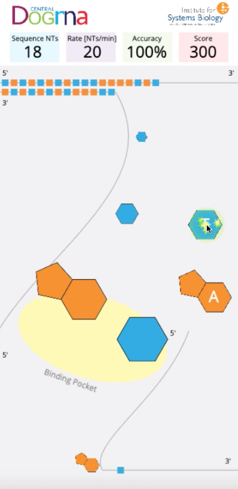

# Central Dogma Game - Gamifying the essentials of the central dogma of molecular biology



## Description

Learn the essentials of Central Dogma by playing a quick game. See who can make the pairs the fastest, while maintaining accuracy.

## Play Now!

The game is hosted through A2Hosting which can be managed through its CPanel. It currently hosts the main website as well as this game, which can be found and played online.
Website: http://centraldogmagame.com/
Game: http://centraldogmagame.com/game


## Main Source

The entryway for the main codebase begins at [main.js](static/js/main.js). This file also houses the basic configuration
for the individual levels.

## JavaScript Documentation

When developing on the game, do check the [JSDoc](https://baliga-lab.github.io/central-dogma-game/jsdoc/) which has all the functions and classes properly documented. Additionally, the code is full of in-line comments explaining potentially convoluted, lengthy, or nondescript sections.

### Programming Levels

Levels are defined in the main JavaScript file. They are contained in a JSON list with the levels in order. A sample level
for the nucleotides level may look something like this.
```json
        // Level 9
        {
            "ntSequence": "AUGCCGGGUCAUGGGCCCACUGACCAUGGGUUUUAG",
            "unlocked": true,
            "name": "Lost in Translation!",
            "description": "Match the condon ([color=" + COLOR_RNA + "]RNA[/color]) with the anticodon. Anticodons code for specific amino acids to make [color=" + COLOR_PEPTIDE + "]protein[/color]!",
            "descriptionVocab": [
                {
                    text: "Match the ",
                    x: 20,
                    y: 300
                },
                {
                    text: "[color=" + COLOR_TERM + "]codon[/color] ",
                    x: 105,
                    y: 300,
                    popup: "A triplet sequence of DNA or RNA nucleotides corresponding to a specific amino acid or a start/stop signal in translation."
                },
                {
                    text: "(RNA) with the ",
                    x: 162,
                    y: 300
                },
                {
                    text: "[color=" + COLOR_TERM + "]anticodon[/color]. ",
                    x: 20,
                    y: 330,
                    popup: "Sequence of three nucleotides in tRNA that pairs with the corresponding codon in mRNA in translation."
                },
                {
                    text: "Anticodons code for specific",
                    x: 111,
                    y: 330
                },
                {
                    text: "[color=" + COLOR_TERM + "]amino acids[/color] ",
                    x: 20,
                    y: 360,
                    popup: "Amino acids are small molecules that serve as building blocks of proteins."
                },
                {
                    text: "to make protein!",
                    x: 123,
                    y: 360
                },
            ],
            "description_image": {
                "name": "level16_description",
                "x": 200,
                "y": 492,
                "scale": 0.13
            },
            "process": "translation",
            "speed": SPEED_SLOW,
            "popups": {
                "intro": "Now that you know how to make DNA and RNA, lets make <style='color:" + COLOR_TERM + "'>protein</style>. Tap the codon to submit, or push 1 or 2 on a keyboard.",
                "firstCorrectMatch": "Correct! Nucleotide pairing rules still apply.",
                "error5Match": "Whoops! Nucleotide pairing rules still apply."
            },
            "rotateNT": false,
            "ntType": "basic",
            "lvlType": "codon_transcription",
            "maxButtons": 1,
            "quiz": {
                "question": "Three base pairs are called a __________.",
                "options": [
                    "Codon", // first option is correct
                    "Amino Acid",
                    "Peptide",
                    "DNA",
                ],
            },
            "sequencedinfo": {
                "name": "insulin",
                "description": "<strong>Insulin</strong> is a <span style='color: blue;'>gene</span> that codes for a peptide (sequence of <span style='color: red;'>amino acids</span>) that acts as a hormone to regulate metabolism",
                "infourl": "https://www.cdc.gov/diabetes/basics/diabetes.html",
                "imgurl": "./static/img/flashcard/insulin.png",
            },
            "knowledgepanel": {
                "description": "<strong>Promoter sequences</strong> are <span style='color: forestgreen;'>DNA</span> sequences that define where transcription of a <span style='color: blue;'>gene starts</span>.",
                "imgurl": "./static/img/flashcard/promoter_dna.png",
            },
        },
```

Here is a reference of what kind of properties each level can contain.

| Property | Description |
| --- | --- |
| ntSequence | Sequence of nucleotides that the level should provide for the player. They are the incoming nucleotides. For codons level, the length of the sequence must be divisible by 3. |
| controls | A list of nucleotides that should be given to the players to choose from. They are not applicable to the `codon_transcription` level type as they are just being randomized anyways. |
| unlocked | Should the level be playable? |
| name | The name of the level. Should be clever and punny. |
| description | The description of the level. There is an interpreter to take in hexcodes to color text (follow existing levels as examples of how to use it) |
| descriptionVocab | The description of the level, but seperated out into vocab words. Each group of words has a position, and optional popup. See included example above for how to use this system. Clicking on words with a `popup` field will show that popup when the word is clicked. This is an optional field, if omitted it will use the description field above instead. |
| description_image | The image to accompany the description of the level. Typically a diagram of some sort. This is an optional field, if omitted, no image will appear. |
| process | The process the level is depicting. This is used for conditional rendering for game UI/graphics. Can be `dna replication`, `transcription`, or `translation`. |
| speed | How much delay in milliseconds there should be before the game ticks by a step. The smaller the number, the faster the tick, thus a quicker pace. |
| popups | What should the player be informed on during gameplay? Contains a javascript object with type of popup mapped to the popup text. Use `<style>` to style the popup text. Use mustache templates `{{ }}` to have the game fill in dynamic details. |
| rotateNT | If the nucleotide buttons should be able to be rotated into the correct position before submitting. |
| ntType | The level of details for the nucleotides that players see. Choose from `basic`, `hbonds`, or `backbone`. (This hasn't been used for nearly a year, very likely it is obsolete or not functional anymore.)|
| lvlType | The type of level that the game should souce from. `dna_replication` or `codon_transcription`. This is different from the previous `process` field because this changes the level type completely, not small graphical nuances. |
| quiz | The quiz containing `question` and the avaliable `options` list for the question. The first option is correct, the others are wrong. |
| sequencedinfo | Information regarding to what just has been sequenced. Containing the `name` of the molecule, html `description`, more information `infourl`, and related image `imgurl` |
| knowledgepanel | Small knowledge panel that contains the `description` html and `imgurl` |
| endMessage | An end message for the user. Intended for telling them what they sequenced, a less detailed version of the previous `sequencedinfo` field, and either this OR sequenced info should be used, not both. This is an optional field. |

#### Popups

There are multiple popups variations to choose from. You may assign one popup variation each per level.

| Popup Variation | Behavior | Template Parameters |
| --- | --- | --- |
| firstCorrectMatch | When the player makes a first correct match, compliment them with something! | `nucleotide1` & `nucleotide2` -> the two nucleotides that the player has made |
| errorMatch | When the player makes an incorrect match, inform them. | `nucleotide1` & `nucleotide2` -> the two nucleotides that the player has made |
| error5Match | On every 5 incorrect matches made, show this popup. | `nucleotide1` & `nucleotide2` -> the two nucleotides that the player has made |

##### Templates Object

Of course, knowing what the templates contain would be important to designing a bold popup.

###### Nucleotide

| Property | Description | Example |
| --- | --- | --- |
| name | The name of the nucleotide | Thymine |
| color | The hex color of the nucleotide | #31ace0 |

###### Codon

| Property | Description | Example |
| --- | --- | --- |
| name | The amino acid name | phenylalanine |
| color | The hex color of the nucleotide | #0055ff |


## Summary of files

### Main Files
These are the main top level files that are essential for the game.
- **js/central_dogma_api** - The API for the game
- **js/main.js** - Initializes a phaser game with level data


### Modules
These are classes for the various objects in the game.
- **js/modules/audioplayer.js** - Class representing an audio player to play music and sounds.
- **js/modules/backgroundfloater.js** - Class that creates background floating particles. It's used for the main menu and in-game levels.
- **js/modules/codon.js** - Class representing a single codon triplet
- **js/modules/game.js** - Main game class, responsible for importing all assets and initial phaser config. Used in main.js for starting a phaser instance.
- **js/modules/gamescore.js** - Class representing the scoring in a level
- **js/modules/nucleotide.js** - Class representing a single nucleotide.
- **js/modules/popupmanager.js** - Class to manage in-game popups. It grabs config data from the level data in main.js.
- **js/modules/positionmanager.js** - Manages all the movement and its timing for the game.

### Scenes
These are the various screen which contain and organize UI and graphic elements.

- **js/modules/scene/about.js** - An about page, it's currently empty and unused.
- **js/modules/scene/countdownResume.js** - The screen used for countdowns, which appear after dialog popups and resuming the game after pausing.
- **js/modules/scene/levelcomplete.js** - The screen that appears after a level is completed. Responsible for some fun animations and submitting the score/level performance with the API.
- **js/modules/scene/levelstage.js**- The main game screen. Has a ton of conditional rendering depending on the level config data from main.js. All the levels use this screen.
- **js/modules/scene/listlevels.js** - The level selection screen. Also responsible for displaying the leaderboard.
- **js/modules/scene/loginscreen.js** - The login screen. The user is also taken back here if they click "sign in" on the main menu when not already signed in.
- **js/modules/scene/logoscreen.js** - Short scene for showing off the game's logo and ISB logo.
- **js/modules/scene/pause.js** - The pause screen.
- **js/modules/scene/popupdisplayscene.js** - The scene that overlays the main gameplay, responsible for handling dialog popups.
- **js/modules/scene/prelevelstage.js** - A scene that briefly appears after selecting the level from the level select screen and before loading into the actual level stage. Responsible for priming the player with some pre-level text (also defined in the main.js level data) and fading in/out.
- **js/modules/scene/quiz.js** - Quiz screen that overlays the main gameplay. Handles all the logic for layout and selecting choices. At the end, will submit quiz performance via API.
- **js/modules/scene/titlescreen.js** - The main menu screen.


## General workflow and tips
- Adjusting the game's speed, object movement, path, and generally how movement occurs in this game in general is done in the positionmanger.js file.
- The codon object uses the nucleotide object to construct itself.
- Both nucleotide and codon classes have functions to render themselves as the small colored blocks that are seen in game before they grow to their actual size.
- Moving between scenes means passing all the game data around and initializing the new scenes with it, and this is necessary to preserve global variables like SCORE and level performance. These global variables are initially found in game.js.
- The quiz data is submitted right after the player finishes a quiz, and the level performance data is submitted right after the player reaches the level complete screen.

## Common objects

### Global
*Found in game.js*

```
        this.GLOBAL = {
            SCORE: 0, // Overall score as an Int,
            ACTIVE_MUSIC: true, // Boolean to indicate whether music should be played or not.
            ACTIVE_EFFECTS: true, // Boolean to indicate whether the player is playing with effects (screen shake/flash)
            ACTIVE_EDUCATION: true, // Boolean to indicate whether the player is playing with quizzes enabled
            QUIZ_RESULTS: [], // Array of "quiz" objects
            LEVEL_PERFORMANCE: [] // Array of "level" objects
        };
        this.sessionID = ""; // sessionID is stored after login
        this.userName = ""; // built username is stored after login
        this.questionPool = {
            beginning: [0, 1, 2, 3, 4, 5, 6, 7, 8],
            middle: [9, 10],
            end: [11, 12, 13, 14, 15, 16, 17, 18, 19, 20, 21]
        }; // Question pool is inialized here, and also on the login screen (because it is a guaranteed screen that will happen first on every playthrough.)
```


## Contributors

- Jacob Valenzuela: Project Manager
- Wei-Ju Wu: API Developer
- [Jeremy Zhang](https://courses.cs.washington.edu/courses/cse154/19su/staff/about-me/jeremy-zhang/about.html): Game Developer
- [Joshua Maza](http://joshuamaza.com/): Game Developer
